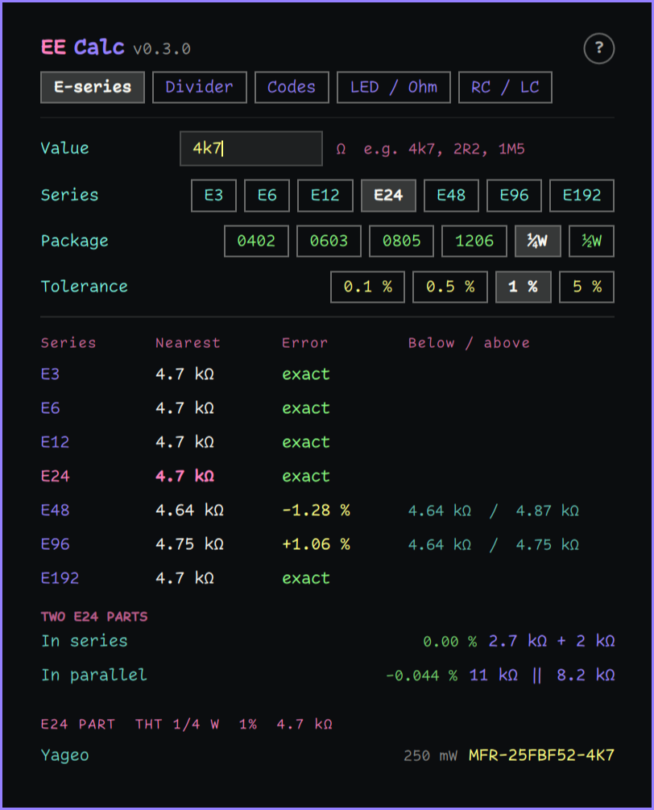
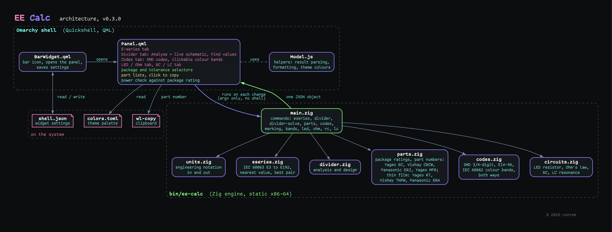

# EE Calc

An electronics bench calculator for the Omarchy Quattro bar.


- **E-series:** type a resistance and see the nearest E3, E6, E12, E24,
  E48, E96 and E192 values, the values either side, and the error of each.
  It also finds the best two-part series and parallel combination from the
  series you pick.
- **Divider, Analyse:** Vin, R1, R2 and an optional load give Vout (loaded
  and unloaded), the ratio, current, the power in each part, and the
  source resistance R1 || R2.
- **Divider, Find values:** Vin and a target Vout give the best standard
  R1/R2 pairs from your chosen series, kept within a total-resistance
  range (default 10 kΩ to 1 MΩ).
- **Codes:** a value gives its SMD marking codes (3-digit, 4-digit,
  EIA-96) and its colour bands. A code printed on a part gives its value,
  and clicking the bands of a drawn resistor reads 4-, 5- and 6-band
  colour codes.
- **LED / Ohm:** the series resistor for one or more LEDs, with the
  current and power it gives. Ohm's law works out the other two of
  voltage, current, resistance and power from any two.
- **RC / LC:** any two of R, C and the cutoff (or the time constant) give
  the third; any two of L, C and the resonant frequency give the third.
  Each suggests the nearest standard part.
- **Part numbers:** pick a package (0402, 0603, 0805, 1206, or ¼ W / ½ W
  through hole) and a tolerance (0.1 %, 0.5 %, 1 % or 5 %), and every
  result lists real manufacturer part numbers for Yageo, Vishay and
  Panasonic. Click a part number to copy it.
- **Power check:** in the divider and the LED calculator, each resistor's
  dissipation is shown as a share of the chosen package's rating: green up
  to half, yellow up to the rating, red beyond it.

The **[user manual](docs/USER_MANUAL.md)** explains every feature, reading
and message. The **?** at the top right of the panel opens it at the
section for the screen you are on.

## Updates

- **v0.3.0:** E192, 0.1 % and 0.5 % parts, marking codes and colour
  bands, LED resistor and Ohm's law, RC and LC. See below.
- **v0.2.6:** the panel header shows the installed version next to the
  name.
- **v0.2.5:** version and documentation update. No change to the
  calculator.
- **2026-10-01:** added the [user manual](docs/USER_MANUAL.md) and an
  [architecture diagram](#architecture). No change to the plugin itself.

## What's new in 0.3.0

The four features shown as planned in the architecture diagram are now
built, and the panel has a row of five tabs under its title.

- **E192 series** in the E-series tab and in divider design.
- **0.1 % and 0.5 % part numbers:** thin-film parts from Yageo RT,
  Vishay TNPW and Panasonic ERA, all ±25 ppm/K. These come in 0402 to
  1206 only; there is no through-hole part at these tolerances.
- **Codes tab:** value to SMD codes and colour bands, SMD code to value,
  and colour bands to value on a drawn resistor whose bands you click. A
  code that can be read more than one way, such as `10R`, shows every
  reading.
- **LED / Ohm tab:** LED series resistor, and Ohm's law and power from any
  two values.
- **RC / LC tab:** RC time constant and cutoff, LC resonance, each with the
  nearest standard part.
- **Help button:** the **?** at the top right of the panel opens the user
  manual at the section for the screen you are on.

Every new calculation was checked against an independent reference built
from the manufacturers' datasheets and the IEC standards, about 196,000
comparisons in all. The results of the 0.2 calculators are unchanged.

## What's new in 0.2.6

The panel header now shows the installed version next to the name, for
example **EE Calc v0.2.6**. It is read from the plugin's `manifest.json`,
so it always matches the version you have. The calculator is unchanged.

## What's new in 0.2.5

Version number and documentation only. The calculator is unchanged from
0.2.0.

The marketplace lists EE Calc as Manual setup because the plugin includes
a ready-built program. Install it with the two commands under
[Install](#install); no Zig and no build step are needed.

## What's new in 0.2.0

Version 0.1.0, the first release of EE Calc, had a flaw in its
installation: users had to leave the Omarchy Plugin Marketplace, follow
instructions on GitHub that were unclear, and install the Zig compiler to
build the plugin themselves.

Version 0.2.0 replaces that with a ready-built program included in the
plugin. Installing is now two commands, with no Zig and no build step (see
[Install](#install)).

To make up for the inconvenience, 0.2.0 also adds a package selector (0402
to 1206, plus through-hole), a 1 % / 5 % tolerance choice, manufacturer
part numbers for Yageo, Vishay and Panasonic, and a power check that shows
how hard each resistor is working against its package rating.

## Screenshots

**E-series:** the nearest value in every series, with the error
colour-coded (green within 1 %, yellow within 5 %, red beyond), the best
two-part combination, and part numbers for the chosen package and
tolerance.


**Divider, Analyse:** a live schematic with Vout, current and each
resistor's power against its package rating. Here R1 is at 97 % of an
0603's rating, so it shows in yellow.


**Divider with a load:** the load is drawn into the schematic, and the
panel adds the unloaded Vout and the load's current and power.


**Divider, Find values:** the best standard R1/R2 pairs for a target Vout,
ranked by error, with part numbers for the best pair.


**Through-hole:** ¼ W and ½ W metal-film parts, here a 4.7 kΩ 5 % resistor.



Shown with the Dracula Pro Van Helsing theme and the Comic Code Ligatures
font. The panel takes its colours from whichever Omarchy theme is active.

## Input

Values take engineering notation: `4k7`, `4.7k`, `2R2`, `R47`, `1M5`,
`100n`, `47u`. Lowercase `m` is milli and uppercase `M` is mega.

## Part numbers

Part numbers are built offline from each manufacturer's published
ordering-code scheme, so they need no network and no account. Check stock
with your distributor as usual.

| Package | Tolerance | Families | Example (4.99 kΩ) |
|---|---|---|---|
| 0402 to 1206 | 1 %, 5 % | Yageo RC, Vishay CRCW e3, Panasonic ERJ | `RC0603FR-074K99L`, `CRCW06034K99FKEA`, `ERJ3EKF4991V` |
| 0402 to 1206 | 0.1 %, 0.5 % | Yageo RT, Vishay TNPW e3, Panasonic ERA (thin film, ±25 ppm/K) | `RT0603BRD074K99L`, `TNPW06034K99BEEA`, `ERA3AEB4991V` |
| ¼ W, ½ W through hole | 1 %, 5 % | Yageo MFR metal film | `MFR-25FBF52-4K99` |

The examples are 0603 at 1 % and 0.1 %, and ¼ W at 1 %.

- 5 % parts are made in E24 values only. The panel says so when a value
  is E96-only, rather than inventing a part number. At 0.1 % and 0.5 %,
  Yageo and Panasonic make E24 and E96 values, and Vishay E24 and E192.
- Each family's resistance range is respected. Panasonic 1 % starts at
  10 Ω, for example, so a 2.2 Ω part lists only Yageo and Vishay.
- Panasonic marks its 1206 sizes "not recommended for new design"; the
  panel shows that next to the part.
- The power check uses the lowest standard rating among the makers for
  that package, so a pass holds whichever part you buy: 0402 62.5 mW,
  0603 100 mW, 0805 125 mW, 1206 250 mW, through hole 250 mW or 500 mW.

Sources, all manufacturer datasheets: Yageo RC_L (V.14, Nov 2025), Vishay
D/CRCW e3 (doc. 20035, Apr 2026), Panasonic ERJ ±1 % (AOA0000C304, May
2025) and ±5 % (AOA0000C301, Dec 2022), Yageo MFR (V.4, Apr 2024), Yageo
RT (V.17, Feb 2026), Vishay TNPW e3 (doc. 28758, Apr 2026) and Panasonic
ERA (AOA0000C307, Apr 2024). The example part numbers printed in those
datasheets are among the engine's tests.

## How it works

The panel is QML. Every calculation is done by a small Zig program,
`bin/ee-calc` (a 480 KB static x86-64 binary, built from `engine/`),
which the panel runs as you type. The program prints one
JSON object and nothing else. It makes no network connections, needs no
privileges and writes no files. The panel itself writes only its own
entry in `shell.json` (the settings below). Copying a part number uses
`wl-copy`, which Omarchy ships.

The E-series tables are hard-coded from IEC 60063. E24 and the series
below it include the historical values (2.7, 3.0, 3.3 … 8.2) that the
10^(i/n) formula does not produce, and E192 has 9.20 where the formula
gives 9.19. Marking codes follow Yageo's marking guide and the EIA-96
table; colour bands follow IEC 60062:2016.

## Architecture



The diagram is generated from `docs/architecture.dot` with Graphviz.

## Install

You need Omarchy Quattro on a 64-bit (x86-64) PC. Nothing else: the
calculator program comes ready-built in the plugin.

**1. Add the plugin.** In a terminal, run:

```
omarchy plugin add https://github.com/conree/omarchy-ee-calc.git
```

That address is this GitHub page. Omarchy shows a warning that plugins run
with your permissions and asks you to confirm, then downloads the plugin to
`~/.config/omarchy/plugins/conree.ee-calc/`. It then asks whether to switch
it on now: answer **Yes** and choose where on the bar it goes (then skip
step 2), or **No** to look through it first.

**2. Switch it on**, if you answered No:

```
omarchy plugin enable conree.ee-calc
```

A calculator icon appears on the right of your bar (or wherever you
placed it in step 1).

**3. Try it.** Click the icon and type `4k7` in the Value box. You should
see the nearest standard values in every series.

If the panel says the calculator program is missing, the download was
incomplete: remove the plugin (below) and add it again.

### Update

```
omarchy plugin update conree.ee-calc
```

The ready-built program is one of the plugin's files, so an update
replaces it along with everything else.

### Remove

```
omarchy plugin remove conree.ee-calc
```

### Download only the program

From 0.2.0 on, each version is also published on the
[Releases page](https://github.com/conree/omarchy-ee-calc/releases), with
the program and its SHA-256 checksum. The **Releases** link on the right of
the GitHub page goes there.

## Use

Click the calculator icon in the bar. Each field updates the result as
you type. **Enter** recalculates at once and **Esc** closes the panel.

The command line works on its own too:

```
bin/ee-calc eseries 4k99 --series E96
bin/ee-calc divider --vin 12 --r1 10k --r2 2k2 --rl 100k
bin/ee-calc divider-solve --vin 12 --vout 3.3 --series E24
bin/ee-calc parts 4k99 --package 0603 --tolerance 1
bin/ee-calc codes 4k7
bin/ee-calc marking 68C
bin/ee-calc bands yellow,violet,red,gold
bin/ee-calc led --vs 5 --vf 2 --if 10m
bin/ee-calc ohm --v 12 --r 1k
bin/ee-calc rc --r 10k --f 1k
bin/ee-calc lc --l 10u --f 1M
bin/ee-calc help
```

## Settings

Stored on the widget's entry in `~/.config/omarchy/shell.json`:

| Key      | Default                | Meaning                                                    |
|----------|------------------------|------------------------------------------------------------|
| `series` | `E24`                  | Series for combinations and divider design                 |
| `tab`    | `E-series`             | Calculator the panel opens on; follows the last one used   |
| `font`   | `Comic Code Ligatures` | Panel font. Falls back to the shell font if not installed. |
| `packageCode` | `0603` | Package for part numbers and the power check |
| `tolerance` | `1` | Tolerance in percent: `0.1`, `0.5`, `1` or `5` |

Comic Code is a commercial font by Tabular Type Foundry. It is not
included here; the plugin only refers to it by name.

Colours come from the active Omarchy theme: the accent, the theme's red
for large errors, and its green and yellow (`color2` and `color3` in
`colors.toml`) for close and fair matches.

## License

MIT. See `LICENSE`.
