# EE Calc user manual

Version 0.3.1. For EE Calc, the electronics bench calculator plugin for the
Omarchy Quattro bar.

## 1. What EE Calc does

EE Calc is a calculator panel that opens from an icon on your Omarchy bar.
It has five tabs, in a row under the title:

- **E-series:** type a resistance and see the nearest standard value in
  each of the E3, E6, E12, E24, E48, E96 and E192 series, how far off each
  one is, the best two-resistor combination, and real manufacturer part
  numbers.
- **Divider:** analyse a resistive voltage divider (with an optional load),
  or find standard resistor pairs that give the output voltage you need.
  Both show part numbers, and Analyse checks each resistor's power against
  its package rating.
- **Codes:** turn a value into its SMD marking codes and colour bands, a
  code printed on a part into its value, or colour bands into a value.
- **LED / Ohm:** the series resistor for one or more LEDs, and Ohm's law
  and power from any two values.
- **RC / LC:** RC time constant and cutoff, and LC resonance, each with
  the nearest standard part.

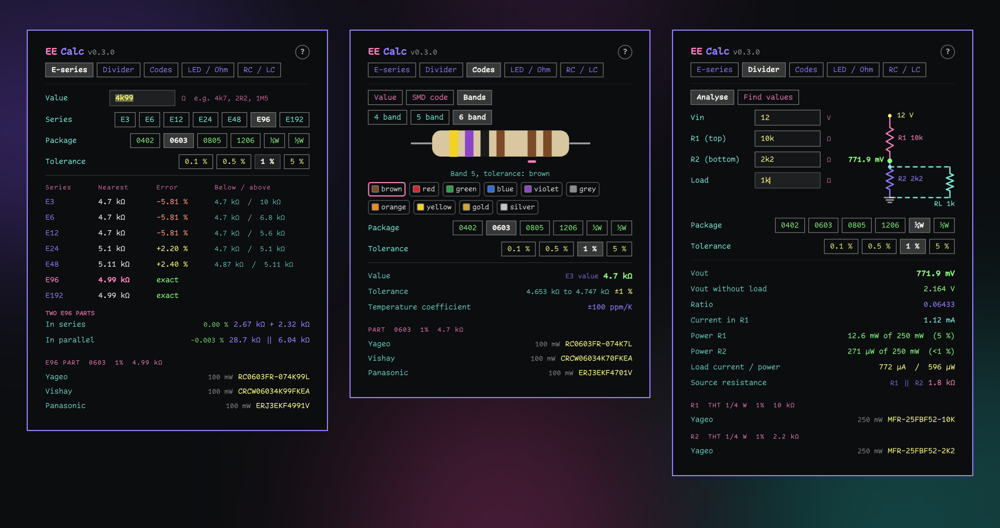

## 2. Install, enable, update and remove

You need Omarchy Quattro on a 64-bit (x86-64) PC. The calculator program
comes ready-built in the plugin, so nothing else is needed.

**Install.** In a terminal, run:

```
omarchy plugin add https://github.com/conree/omarchy-ee-calc.git
```

Omarchy shows a warning that plugins run with your permissions and asks you
to confirm. It then asks whether to switch the plugin on now: answer
**Yes** and choose where on the bar it goes, or **No** to look through it
first.

**Enable**, if you answered No:

```
omarchy plugin enable conree.ee-calc
```

A calculator icon appears on the right of your bar, or wherever you placed
it.
The panel header shows the installed version next to the name, for example
**EE Calc v0.3.1**.

**Update:**

```
omarchy plugin update conree.ee-calc
```

**Remove:**

```
omarchy plugin remove conree.ee-calc
```

## 3. Using the panel

- **Open and close** the panel by clicking the calculator icon. **Esc**
  also closes it, including while you are typing in a box.
- **Tabs and modes.** Click a tab in the row under the title. Some tabs
  have a second row of buttons for their modes, such as **Analyse** and
  **Find values** on the Divider tab.
- **Help.** The **?** at the top right opens this manual in your browser,
  at the section for the tab and mode you are on. It opens the manual for
  your installed version, from GitHub, so it needs an internet
  connection.
- **Results update as you type.** Press **Enter** to recalculate at once.
- **The boxes open with example values** (for instance `4k99` on the
  E-series tab) so the panel shows a result straight away. Select a box and
  type over the value.
- **Remembered between sessions:** the tab you last used, and your Series,
  Package and Tolerance choices. The mode within each tab and the colour
  bands you set are not remembered. The values in the boxes return to the
  examples when the Omarchy shell restarts.

## 4. Entering values

Values use engineering notation. Spaces are ignored, and a unit symbol at
the end is allowed but not needed.

| You type | Means | Notes |
|---|---|---|
| `4700`, `4.7k`, `4k7`, `4K7` | 4.7 kΩ | The prefix letter can stand in for the decimal point |
| `2R2`, `2r2` | 2.2 Ω | `R` marks the decimal point for ohms |
| `R47` | 0.47 Ω | Only `R` may start a value |
| `1M5` | 1.5 MΩ | Capital `M` is mega |
| `1m` | 0.001 | Lowercase `m` is milli |
| `100n`, `47u`, `47µ`, `10p` | nano, micro, pico | |
| `1G`, `1T` | giga, tera | |
| `1e3` | 1000 | Scientific notation |
| `10ohm`, `4k7Ω`, `3.3V` | 10 Ω, 4.7 kΩ, 3.3 | Trailing `Ω`, `ohm`, `ohms`, `V`, `A` or `W` is accepted |
| `100nF`, `10uH`, `1kHz`, `2ms` | 100 n, 10 µ, 1000, 0.002 | Trailing `F`, `H`, `Hz` or `s` is accepted too |

Limits:

- Values must be between 1e-15 and 1e15 in size. Anything outside that, and
  text that is not a number, gives **"not a number"**.
- The E-series tab and the Codes tab's Value mode accept 1 mΩ to 100 GΩ.
- The unit letter is not checked against the box. `10V` typed in a
  resistance box is read as 10 Ω.
- Resistances, voltages and loads must be above zero.

## 5. Series, Package and Tolerance

These three rows of buttons sit below the input boxes. Each choice is
remembered. A row appears only on the tabs that use it.

| Control | Choices | Used by |
|---|---|---|
| **Series** | E3, E6, E12, E24, E48, E96, E192 | E-series: the two-part combinations and the part list. Divider, Find values: the values it chooses from. LED: the resistor values it chooses from. RC: the resistor suggested when R is worked out. |
| **Package** | 0402, 0603, 0805, 1206, ¼W, ½W | E-series, Divider, Codes and LED: the part numbers, and the power check on the Divider and LED. ¼W and ½W are through-hole metal-film resistors. |
| **Tolerance** | 0.1 %, 0.5 %, 1 %, 5 % | The same tabs as Package: the part numbers, and on the Codes tab the tolerance band. 5 % parts are made in E24 values only. 0.1 % and 0.5 % parts are thin film, 0402 to 1206 only. |

## 6. The E-series tab

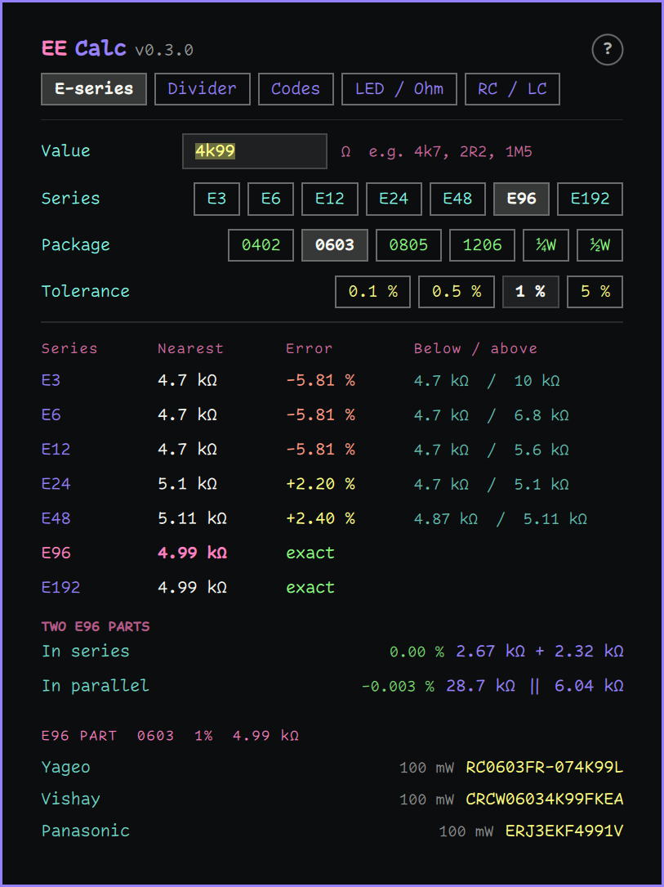

Type a resistance in **Value**. The table shows one row per series:

- **Nearest:** the closest standard value. "Closest" is judged by ratio,
  the way tolerances work, not by the difference in ohms. If a value falls
  exactly midway by ratio, the lower value is chosen.
- **Error:** how far the nearest value is from what you typed, as a
  percentage. **exact** means it is already a standard value.
  - Green: exact, or within 1 %.
  - Yellow: within 5 %.
  - Red: more than 5 % away.
- **Below / above:** the standard values on either side.

The row for the series you chose under **Series** is highlighted in pink.

**Two parts.** Below the table, EE Calc gives the best combination of two
values from your chosen series:

- **In series:** two parts added together.
- **In parallel:** two parts in parallel, shown as `a || b`.

Each shows its error in the same colours. The search covers three decades
either side of your value. When two combinations are equally close, the one
with the more similar pair of values is shown.

**Part list.** At the bottom is the part list for the nearest value in your
chosen series, for the package and tolerance you chose. See
[section 12](#12-part-numbers).

## 7. Divider: Analyse

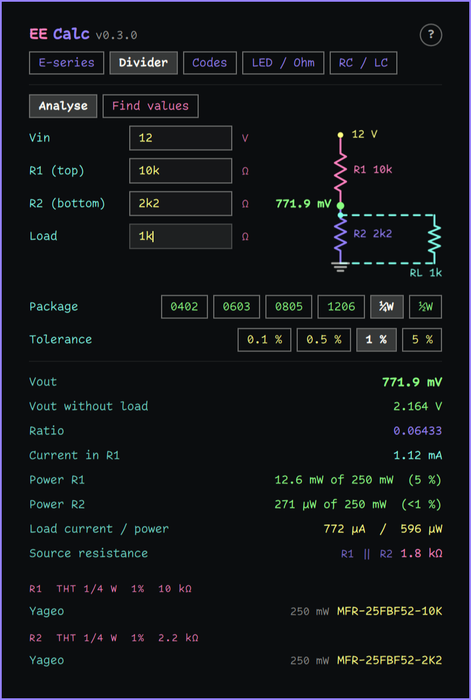

Enter **Vin**, **R1 (top)** and **R2 (bottom)**. **Load** is optional; it
is a resistance across R2, the output.

The **schematic** redraws as you type: Vin at the top, R1, the output node
with its voltage, R2 to ground, and the load (dashed) when one is given.

The readings:

| Reading | Meaning |
|---|---|
| **Vout** | Output voltage, with the load connected if you gave one |
| **Vout without load** | Shown only when there is a load, for comparison |
| **Ratio** | Vout divided by Vin |
| **Current in R1** | The current from Vin, through R1 |
| **Power R1, Power R2** | Power each resistor dissipates, then the package rating and the share of it used, for example *96.7 mW of 100 mW (97 %)* |
| **Load current / power** | Shown only when there is a load |
| **Source resistance** | R1 \|\| R2: the resistance the output presents to a load. It does not include the load itself. |

The power colours:

- Green: up to half the package rating.
- Yellow: above half, up to the rating. The part works but runs hot.
- Red: above the rating. The part is overloaded.

A share below 1 % is shown as **(<1 %)**.

Below the readings are part lists for R1 and for R2, at your chosen package
and tolerance.

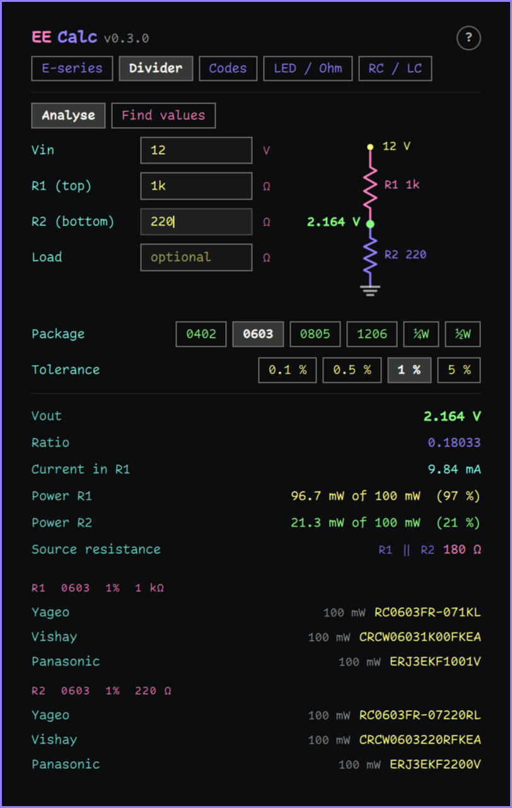

## 8. Divider: Find values

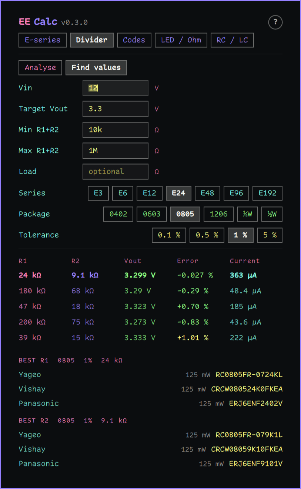

Enter **Vin** and the **Target Vout**. **Min R1+R2** and **Max R1+R2** set
the range the two resistors' total must fall in (10 kΩ and 1 MΩ to start
with). **Load** is optional.

EE Calc tries R1 and R2 values from your chosen **Series** and lists the
five best pairs:

- They are ranked by how close Vout comes to your target. Where two are
  equally close, the pair whose total is nearer the middle of your range
  comes first.
- Pairs with the same R1 : R2 ratio, such as 24k : 9.1k and 240k : 91k,
  give the same Vout without a load, so only one of them is listed.
- The best pair is shown in bold.
- If a resistor in a pair would dissipate more than its package rating, its
  value is shown in red.

Columns: **R1**, **R2**, **Vout** (with the load if you gave one),
**Error** (coloured as on the E-series tab), and **Current** through R1.

Below the list are part lists for the best pair.

If no pair from the series fits the total resistance range, the panel says
so. Target Vout must be below Vin.

## 9. Codes

The Codes tab has three modes: **Value**, **SMD code** and **Bands**.

### Value

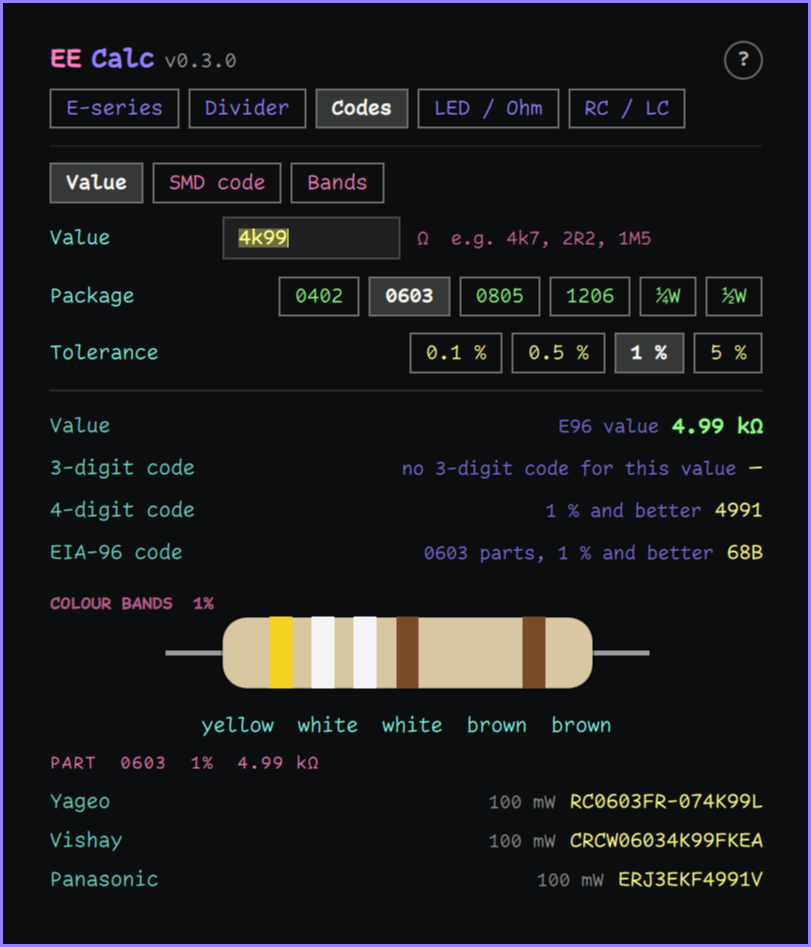

Type a resistance in **Value**. The panel shows:

| Reading | Meaning |
|---|---|
| **Value** | The value, and the lowest E-series it belongs to, or *not a standard value* |
| **3-digit code** | Two figures and a multiplier, as on E24 parts at 2 % and 5 % (`472` is 4.7 kΩ) |
| **4-digit code** | Three figures and a multiplier, as on 1 % and better parts (`4701`) |
| **EIA-96 code** | Two figures for the E96 value and a letter for the multiplier, as on 0603 parts at 1 % and better (`68B` is 4.99 kΩ) |

Values below 10 Ω use `R` as the decimal point (`4R7`, `10R0`). A dash
means that code cannot show the value: a 3-digit code holds only two
figures, and EIA-96 covers only E96 values from 1 Ω to 97.6 MΩ.

**Colour bands.** Below the codes, the value is drawn as a resistor with
its colour bands, with the colours spelled out underneath. The tolerance
band follows your **Tolerance** choice. At 5 %, a value with two figures
gets four bands; every other value gets five, with three figures. When the
value has more figures than the bands can hold, the panel says *No colour
bands for this value*.

The part list for the value is at the bottom.

### SMD code

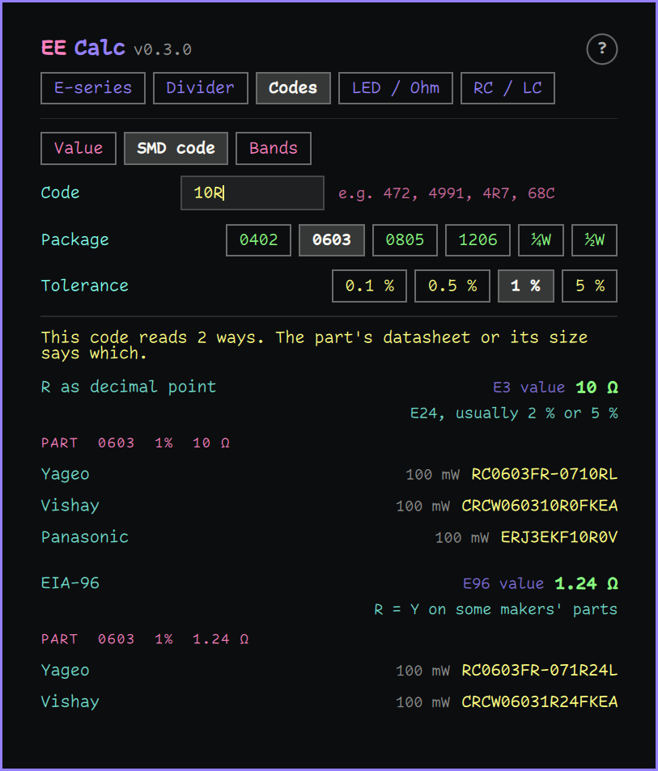

Type the code printed on the part in **Code**: `472`, `4701`, `4R7`,
`R047`, `68C`, or `0` or `000` for a zero-ohm link. Each reading shows the
scheme, the value and a note on the parts that use that scheme, then a
part list.

Some codes can be read more than one way. `10R` is 10 Ω with R as the
decimal point, and it also fits the EIA-96 pattern. The panel then says
*This code reads 2 ways* and shows each reading; the part's size or
datasheet tells you which is right. A few EIA-96 multiplier letters mean
different things to different makers, and the note says so.

Text that is not a marking code gives **not a resistor marking code**.

### Bands

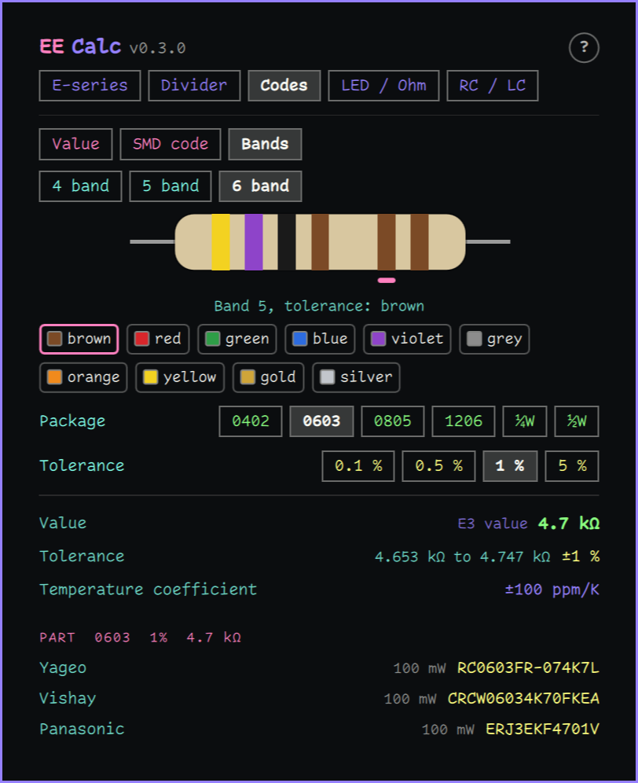

A resistor is drawn with its bands. Choose **4 band**, **5 band** or
**6 band** above it, then click a band. Its colours appear as swatches
below; click one to set the band. Each band only offers the colours
allowed in its place under IEC 60062:2016:

| Band | 4 band | 5 and 6 band | Colours |
|---|---|---|---|
| Figures | 1, 2 | 1, 2, 3 | black to white (0 to 9) |
| Multiplier | 3 | 4 | pink (×0.001), silver, gold, black to white |
| Tolerance | 4 | 5 | brown, red, green, blue, violet, grey, orange, yellow, gold, silver; *none* (±20 %) on 4-band only |
| Temperature coefficient | | 6 | black to grey |

The readings are the **Value**, the **Tolerance** with the lowest and
highest value it allows, and on 6-band resistors the **Temperature
coefficient** in ppm/K. A part list follows.

Changing the band count keeps the value where it can. A value with three
figures cannot fit in four bands, so its third figure is dropped. A
6-band resistor starts with a 100 ppm/K band (brown).

## 10. LED / Ohm

### LED

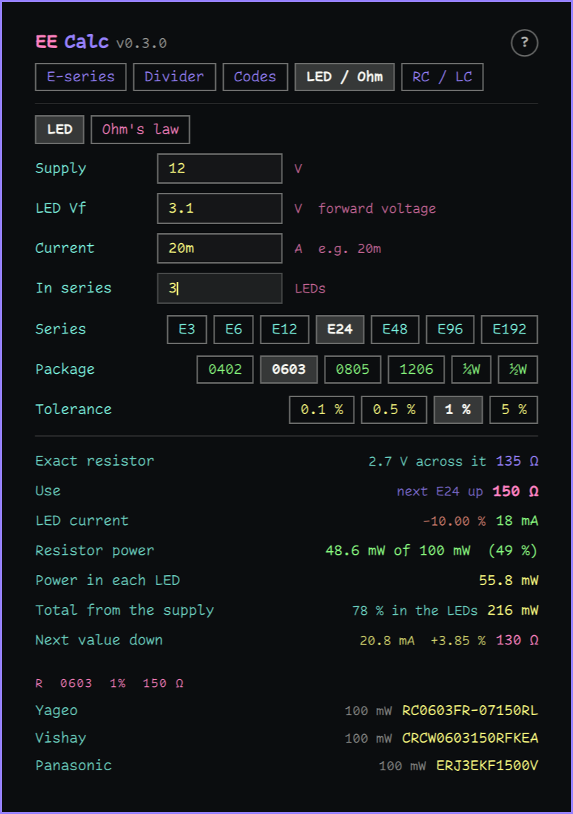

Enter the **Supply** voltage, the LED's forward voltage **LED Vf**, the
**Current** you want, and how many LEDs are **In series** (1 to start
with).

| Reading | Meaning |
|---|---|
| **Exact resistor** | The resistance that gives exactly your current, and the voltage across it |
| **Use** | The next standard value up from your **Series**, so the current does not exceed what you asked for. If the exact value is already standard, it says so. |
| **LED current** | The current with that resistor, and how far it is from your target |
| **Resistor power** | Its dissipation against the package rating, coloured as in the power check (section 7) |
| **Power in each LED** | Vf times the current |
| **Total from the supply** | All the power drawn, and the share that goes into the LEDs |
| **Next value down** | The standard value below, with its current. It runs the LEDs slightly above your target. Shown only when the exact value is not standard. |

The part list is for the value under **Use**. The supply must be above Vf
times the number of LEDs.

### Ohm's law

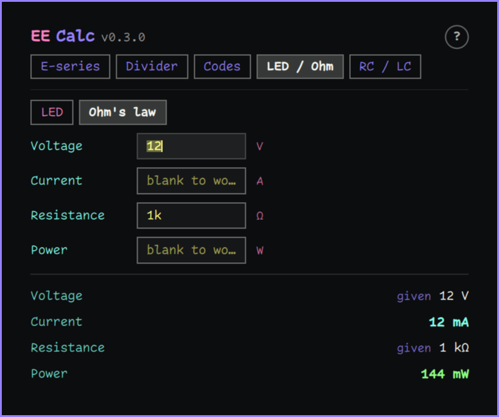

Fill in any two of **Voltage**, **Current**, **Resistance** and **Power**
and leave the other two blank. The two you gave are shown plain and
marked *given*; the two worked out are in bold. If three or four boxes
are filled, the panel asks for exactly two.

## 11. RC / LC

### RC

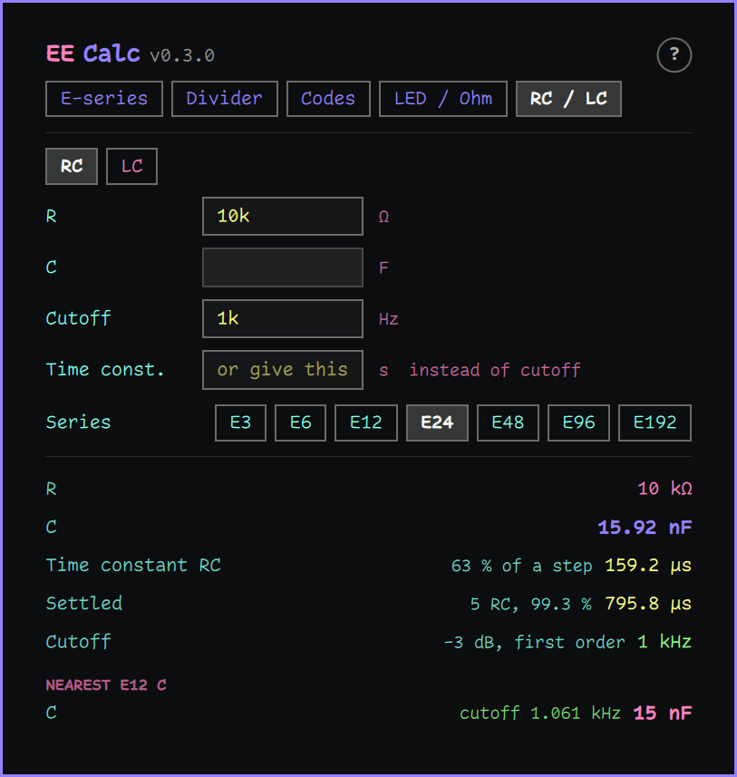

Fill in any two of **R**, **C**, **Cutoff** and **Time const.**, leaving
the rest blank. The cutoff and the time constant say the same thing, so
give one or the other, not both.

| Reading | Meaning |
|---|---|
| **R**, **C** | The worked-out one is in bold |
| **Time constant RC** | The time to reach 63 % of a step |
| **Settled** | 5 RC, when a step has reached 99.3 % |
| **Cutoff** | The −3 dB frequency of a first-order RC filter, 1 / (2π RC) |

**Nearest part.** When R or C is worked out, the panel suggests the
nearest standard part and the cutoff it gives. A resistor comes from your
**Series**; a capacitor from E12, the series capacitors are commonly made
in. No resistor is suggested outside 1 mΩ to 100 GΩ.

### LC

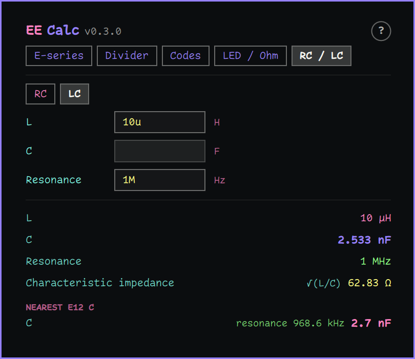

Fill in any two of **L**, **C** and **Resonance**. The readings are L, C,
the resonant frequency 1 / (2π √(LC)), and the **characteristic
impedance** √(L/C). When L or C is worked out, the nearest E12 part is
suggested with the resonance it gives.

## 12. Part numbers

EE Calc builds manufacturer part numbers from each manufacturer's published
ordering scheme. It does this offline: no internet connection, no account,
and no stock check. Check availability with your distributor as usual.

| Package | Tolerance | Manufacturers and families | Example: 4.99 kΩ |
|---|---|---|---|
| 0402, 0603, 0805, 1206 | 1 %, 5 % | Yageo RC, Vishay CRCW e3, Panasonic ERJ (thick film) | RC0603FR-074K99L, CRCW06034K99FKEA, ERJ3EKF4991V |
| 0402, 0603, 0805, 1206 | 0.1 %, 0.5 % | Yageo RT, Vishay TNPW e3, Panasonic ERA (thin film) | RT0603BRD074K99L, TNPW06034K99BEEA, ERA3AEB4991V |
| ¼W, ½W through hole | 1 %, 5 % | Yageo MFR metal film | MFR-25FBF52-4K99 |

The examples are 0603 at 1 % and at 0.1 %, and ¼W at 1 %.

**Thin film (0.1 % and 0.5 %).** All three families are ±25 ppm/K. Yageo
RT and Panasonic ERA come in E24 and E96 values, Vishay TNPW in E24 and
E192, so an E192-only value lists Vishay alone. Below 47 Ω Panasonic makes
only 0.5 % parts, at ±50 ppm/K (±100 ppm/K in 0402); the family name in
the list shows which. There are no through-hole parts at these
tolerances.

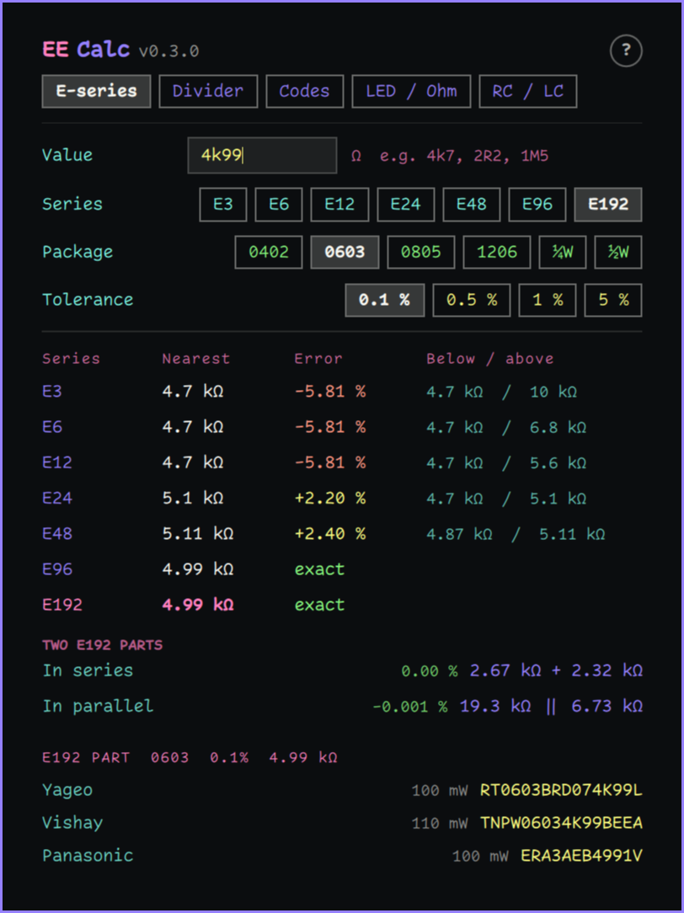

**Copying.** Click a part number to copy it to the clipboard. The power
figure next to it changes to **copied** for a moment.

**Each row shows** the manufacturer, that part's power rating, and the part
number.

**When there is no part,** the list says why:

| Message | Meaning |
|---|---|
| **No 5 % part / choose E24** | 5 % is chosen with the E48 or E96 series. 5 % parts come in E24 values only; choose E24 to see them. |
| **No part / not made at 5 % (E24 values only)** | The value is an E48 or E96 value, which is not made at 5 %. |
| **No part / outside every maker's range for this size** | No manufacturer makes this value in this package at this tolerance. |
| **No part / outside the 1 Ω to 4.7 MΩ range** | Through-hole parts are offered from 1 Ω to 4.7 MΩ. |
| **No part / not a standard E24 or E96 value** | At 1 %, the value is not in a series the parts are made in. |
| **No part / not a standard E24 or E192 value** | At 0.1 % or 0.5 %, the value is not in a series the parts are made in. |
| **No part / no through-hole part at this tolerance** | 0.1 % and 0.5 % are chosen with ¼W or ½W. Choose a chip package. |

A manufacturer is also left out when only that one does not make the value.
For example, Panasonic's 1 % parts start at 10 Ω, so a 2.2 Ω part lists
only Yageo and Vishay.

**"not for new designs"** appears next to Panasonic 1206 parts, because
Panasonic marks those sizes "not recommended for new design".

**The power rating used by the power check** is the lowest standard rating
among the manufacturers for that package, so a pass holds whichever part
you buy. Each row in a part list shows that maker's own rating, which can
be higher; Vishay's thin-film 0603, for example, is 110 mW.

| Package | Rating used |
|---|---|
| 0402 | 62.5 mW |
| 0603 | 100 mW |
| 0805 | 125 mW |
| 1206 | 250 mW |
| ¼W through hole | 250 mW |
| ½W through hole | 500 mW |

**Sources.** The ordering schemes, ranges and ratings come from the
manufacturers' datasheets: Yageo RC_L (V.14, November 2025), Vishay D/CRCW
e3 (document 20035, April 2026), Panasonic ERJ ±1 % (AOA0000C304, May 2025)
and ±5 % (AOA0000C301, December 2022), Yageo MFR (V.4, April 2024), Yageo
RT (V.17, February 2026), Vishay TNPW e3 (document 28758, April 2026) and
Panasonic ERA (AOA0000C307, April 2024). Marking codes follow Yageo's
chip-resistor marking guide (V.3) and the EIA-96 table; colour bands
follow IEC 60062:2016.

## 13. Settings

EE Calc keeps its settings in the plugin's entry in
`~/.config/omarchy/shell.json`. The panel updates them for you; you only
need to edit them by hand for the font.

| Setting | Default | Meaning |
|---|---|---|
| `series` | `E24` | Series for combinations, divider design, the LED resistor and the RC suggestion |
| `tab` | `E-series` | The tab the panel opens on; follows the last one used |
| `packageCode` | `0603` | Package for part numbers and the power check |
| `tolerance` | `1` | Tolerance in percent: `0.1`, `0.5`, `1` or `5` |
| `font` | `Comic Code Ligatures` | Panel font. If it is blank or not installed, the panel uses the Omarchy shell font. |

Colours come from the active Omarchy theme, so the panel follows theme
changes.

## 14. Command line

The calculator program inside the plugin also works on its own. From the
plugin folder, `~/.config/omarchy/plugins/conree.ee-calc/`:

```
bin/ee-calc eseries 4k99 --series E96
bin/ee-calc divider --vin 12 --r1 10k --r2 2k2 --rl 100k
bin/ee-calc divider-solve --vin 12 --vout 3.3 --series E24
bin/ee-calc parts 4k99 --package 0603 --tolerance 1
bin/ee-calc codes 4k7
bin/ee-calc marking 68C
bin/ee-calc bands yellow,violet,red,gold
bin/ee-calc led --vs 5 --vf 2 --if 10m --count 1
bin/ee-calc ohm --v 12 --r 1k
bin/ee-calc rc --r 10k --f 1k
bin/ee-calc lc --l 10u --f 1M
bin/ee-calc help
```

Each command prints one line of JSON. `eseries`, `divider`,
`divider-solve`, `codes`, `marking`, `bands` and `led` also take
`--package` (0402, 0603, 0805, 1206, tht-quarter, tht-half) and
`--tolerance` (0.1, 0.5, 1 or 5) to add part numbers and power checks.
`divider-solve` also takes `--rmin`, `--rmax`, `--rl` and `--count` (1 to
20). `ohm` takes any two of `--v`, `--i`, `--r` and `--p`; `rc` any two of
`--r`, `--c`, and `--f` or `--tau`; `lc` any two of `--l`, `--c` and
`--f`. `bands` takes the colours separated by commas.

## 15. Troubleshooting

| What you see | What it means | What to do |
|---|---|---|
| *The calculator program bin/ee-calc is missing.* | The plugin's program file is not there. | Remove the plugin and add it again (section 2). |
| *The engine could not be started* | The program file is there but would not run. | Remove and add the plugin again. |
| *The engine did not answer* | The program took longer than 3 seconds. | Change a value to try again. If it keeps happening, restart the shell with `omarchy-restart-shell`. |
| *No answer from the engine*, *Engine returned unreadable output* | The program's reply was empty or garbled. | As above. |
| *not a number* | The value could not be read. | Check it against section 4. |
| *value must be between 1 m and 100 G* | E-series value out of range. | Use a value from 1 mΩ to 100 GΩ. |
| *Vout must be below Vin* | Find values target is too high. | Use a target below Vin. |
| *no pair from this series fits the total resistance range* | No pair's total falls between Min and Max R1+R2. | Widen the range or choose a denser series. |
| *R1 must be above zero* (and similar) | A resistance, voltage or load is zero or negative. | Enter a positive value. |
| *not a resistor marking code* | The SMD code matches no scheme. | Check the code on the part; see section 9. |
| *supply must be above Vf* | The LEDs need more voltage than the supply gives. | Raise the supply or reduce the LEDs in series. |
| *enter exactly two of …* | Ohm's law, RC or LC has more than two boxes filled. | Clear the ones you want worked out. |
| *give the cutoff or the time constant, not both* | Both are filled on RC. | Clear one of them. |
| *Type a value…*, *Enter Vin…*, *Enter any two of…* | A required box is empty. | Fill it in. |

## 16. Accuracy and limits

**How the results were checked.**

- 39 automated tests in the calculator program, including the
  example part numbers printed in the manufacturers' datasheets. Eight of
  the thin-film part numbers were also confirmed on a distributor's site.
- Version 0.2: an independent reference calculator, written separately,
  compared against 140 hand-written cases and 600 random ones, and about
  6,000 combinations of value, package, tolerance and manufacturer
  compared against an independently written part-number builder.
  Everything agreed.
- Version 0.3: a second independent reference, built from the datasheets
  and the IEC standards without reading the calculator's code, made about
  196,000 comparisons covering every E192 value, every part number, the
  codes, the colour bands, and the LED, Ohm's law, RC and LC calculators.
  The one defect it found was fixed before release. The 0.2
  calculators give the same results as before.

**Not covered:**

- Codes below 0.1 Ω, such as `R010`, are read but not generated.
- Capacitor and inductor suggestions use E12 only, and there are no part
  numbers for them.

**Keep in mind:**

- Part numbers show what a manufacturer's ordering scheme defines, not what
  is in stock. Check with your distributor.
- Power ratings are at 70 °C, as the datasheets state them. Hotter
  surroundings or a crowded board reduce what a resistor can safely
  dissipate.
- The divider assumes ideal resistors at their nominal values. Real parts
  vary within their tolerance.

---

EE Calc is © 2026 conree, released under the MIT licence.
